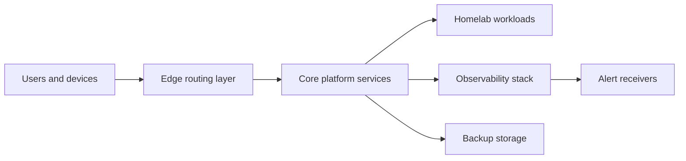

# Architecture

## Purpose

`homelab-core` is the source of truth for operating the core homelab platform:
routing, logging, metrics, alerting, backup, restore, and runbook practices.

The public repository does not currently expose concrete hostnames, network
segments, service endpoints, or deployment tooling. This document therefore
captures the intended architecture and uses clearly marked placeholders where
real environment details are unknown.

## High-Level Model

See `docs/diagrams/platform-overview.mmd` for the standalone diagram source.

## Logical Zones

| Zone | Responsibility | Public repo status |
| --- | --- | --- |
| Edge | Internet ingress, LAN routing, DNS or reverse proxy entry points. | `TODO`: identify actual router/proxy/DNS components. |
| Core platform | Shared operational services such as logging, metrics, alerting, and backup coordination. | Partially represented by example configs. |
| Workloads | Applications hosted on the homelab. | `TODO`: enumerate actual services in `docs/service-inventory.md`. |
| Observability | Metrics, logs, dashboards, alert rules, and notification routing. | Example Prometheus, Alertmanager, and Grafana files are included. |
| Backup storage | Snapshot repositories, object storage, NAS, or removable media. | `TODO`: verify storage provider and retention policy. |

## Trust Boundaries

- Public GitHub content must be safe to share.
- Private runtime configuration must hold secrets, hostnames, IP addresses,
  webhook URLs, credentials, and personal identifiers.
- Monitoring examples in this repo should use loopback, `.example` domains, or
  RFC 5737 documentation addresses.
- Production alert receivers must be configured outside this repository.

## Configuration Strategy

This repo stores only:

- sanitized examples
- documentation
- validation scripts
- runbooks
- diagrams

This repo should not store:

- live secrets
- personal hostnames
- VPN keys
- cloud access tokens
- encrypted backups
- generated state
- live Grafana database exports

## Deployment Assumptions

The current repository history does not identify the deployment engine. Until
that is verified, all deployment-specific references should remain placeholders.

Candidate approaches to document later:

- Docker Compose
- Kubernetes
- Ansible
- Terraform or OpenTofu
- Nix or systemd units

## Operational Interfaces

| Interface | Expected use | Unknowns to resolve |
| --- | --- | --- |
| Metrics scrape targets | Prometheus-compatible `/metrics` endpoints. | Real target hostnames, ports, labels, and TLS model. |
| Log ingestion | Centralized logs for edge, platform, and workload services. | Actual log collector and retention settings. |
| Alert notifications | Human-readable alerts grouped by severity and service. | Real receiver names and escalation channels. |
| Backups | Scheduled snapshots with documented restore process. | Tooling, schedule, encryption, retention, and test cadence. |

## Change Management

For each platform change:

1. Document the intended state.
2. Add or update sanitized config examples.
3. Add a validation check when feasible without private access.
4. Update runbooks for deploy, rollback, or incident response.
5. Record operational unknowns as explicit `TODO` entries.
